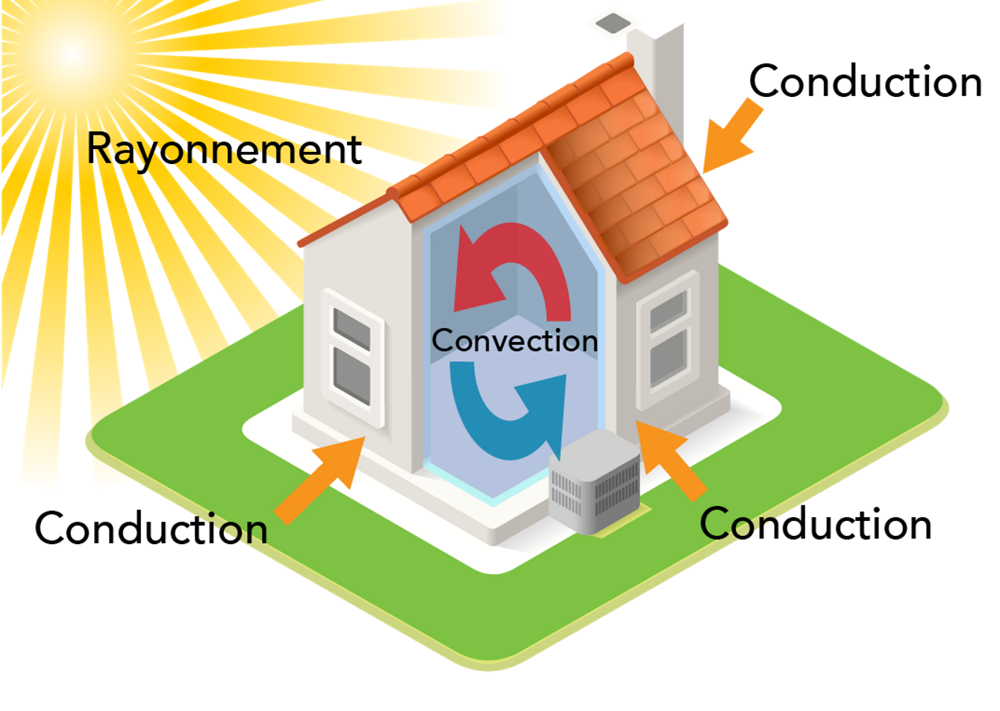

# opti_elec
This repo host a PoC for building KPI in a home assistant app

# Modelisation thermique

## **Différents transferts thermiques**

- La **conduction** ou **diffusion** : Le transfert d'énergie entre objets en contact physique.
- La **convection** : le transfert d'énergie entre un objet et son environnement, dû à un mouvement fluide 
- Le **rayonnement** : le transfert d'énergie par l'émission de rayonnement électromagnétique.

## Flux thermiques associés
`Conduction:`
${\displaystyle \Phi _{1\rightarrow 2}^{\mathrm {conduction}}=\lambda \,S\,{\frac {T_{1}-T_{2}}{e}}={\frac {T_{1}-T_{2}}{R_{\mathrm {th} }^{\mathrm {conduction} }}}}$

`Convection:` 
${\displaystyle \Phi _{1\rightarrow 2}^{\mathrm {convection}}=h\,S\,(T_{1}-T_{2})={\frac {T_{1}-T_{2}}{R_{\mathrm {th} }^{\mathrm {convection} }}}}$

`Rayonnement:`
${\displaystyle \Phi^{\mathrm {ray}} =S\,\varepsilon \,\sigma \,T^{4}}$

## Expression générale du flux thermique
Par construction on peut relier le flux thermique à une quantité de chaleur échangée par unité de temps selon:

${\displaystyle \Phi ={\frac {\delta Q}{\mathrm {d} t}}={\dot {Q}}}$

Par ailleurs, la variation de quantité de chaleur échangée entre deux instants s'écrit:

${\displaystyle {\frac {\delta Q}{\mathrm {d} t}}=\rho \,c_{P}\,{\frac {\partial T}{\partial t}}=C\,{\frac {\partial T}{\partial t}}}$

**Hypothèses:** Le HomeModule est assimilé à un objet ponctuel homogène, si bien que les phénomènes internes de convections sont négligés.\
On omet volontairement la composante radiative des transferts thermiques dans un premier temps.\
Si bien que la combinaison des phénomènes convectifs et conductifs entre extérieur et intérieur en série se combinent si bien que 
${\displaystyle {\Phi _{1\rightarrow 2}^{TT}}={\frac{T_{ext}-T_{int}}{R_{th}}}}$\
On considère ${\displaystyle {\mathcal {P}}}$, l'énergie produite au sein du logement typiquement par les radiateurs.\

## Bilan énergétique
Le `bilan de puissance` donne:

${\displaystyle {\Phi = {\Phi _{1\rightarrow 2}^{TT}} + {\mathcal {P}}} \Leftrightarrow  {C\,{\frac {\partial T}{\partial t}} ={\frac{T_{ext}-T_{int}}{R_{\mathrm {th}}} + {\mathcal {P}}}} \Leftrightarrow {{\frac {\partial T}{\partial t}} ={\frac{T_{ext}-T_{int}}{R_{\mathrm {th}}C}} + {\frac {\mathcal {P}}{C}}}}$

Enfin:

${\boxed {\displaystyle {\frac {\partial T_{int}}{\partial t}}(t) + {\frac {1}{\tau}}*T_{int}(t) = {\frac {1}{\tau}}*T_{ext} + {\frac {\mathcal {P}}{C}}}}$ $(E)$

Avec ${\displaystyle {\tau = R_{th}C}}$

Et ${\displaystyle {{\mathcal {P}} = \left\{\begin{array}{ll} {\mathcal {P}_{rad}} & {si} & {switch=ON} \\ 0 & {sinon.} \end{array}\right.}}$

## Equations différentielles
$(E)$ donne alors:

`COOLING (switch = OFF)`
${\boxed {\displaystyle {\frac {\partial T_{int}}{\partial t}}(t) + {\frac {1}{\tau}}*T_{int}(t) = {\frac {1}{\tau}}*T_{ext}}}$ $(1)$

`HEATING (switch = ON)`
${\boxed {\displaystyle {\frac {\partial T_{int}}{\partial t}}(t) + {\frac {1}{\tau}}*T_{int}(t) = {\frac {1}{\tau}}*T_{ext} + {\frac {\mathcal {P}}{C}}}}$ $(2)$

### Solutions
$(1)$ $\Rightarrow {\boxed {\displaystyle {T_{int} = T_{ext} + [T_{0} - T_{ext}] * e^{\frac {-t}{\tau}}}}}$

$(2)$ $\Rightarrow {\boxed {\displaystyle {T_{int} = T_{lim} + [T_{0} - T_{lim}] * e^{\frac {-t}{\tau}}}}}$ où $T_{lim} = T_{ext} + {\frac {\tau}{C}*{\mathcal {P}}}$

### Pente à l'origine
${\boxed {\displaystyle {{\dot {T_{int}}}(0) = [T_{0} - T_{ext}] * {\frac {-1}{\tau}}}}}$ $(1')$

${\boxed {\displaystyle {{\dot {T_{int}}}(0) = [T_{0} - T_{ext} + {\frac {\tau}{C}*{\mathcal {P}}}] * {\frac {-1}{\tau}}}}}$ $(2')$

### Derive thermal constants
$(1')$ $\Rightarrow {\boxed {\displaystyle {\tau} = {\frac {[T_{0} - T_{ext}]}{{-{\dot {T_{int}}}(0)}}}}}$ 

$(2')$ $\Rightarrow {\boxed {\displaystyle C = {\frac {{\tau}*{\mathcal {P}}}{{\tau}*{\dot {T_{int}}}(0) + T_{0} - T_{ext}} }}}$